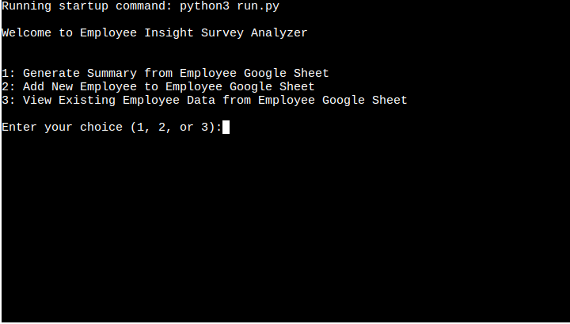
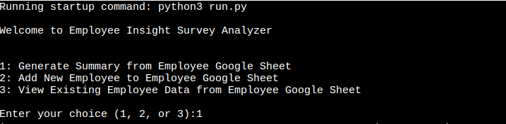
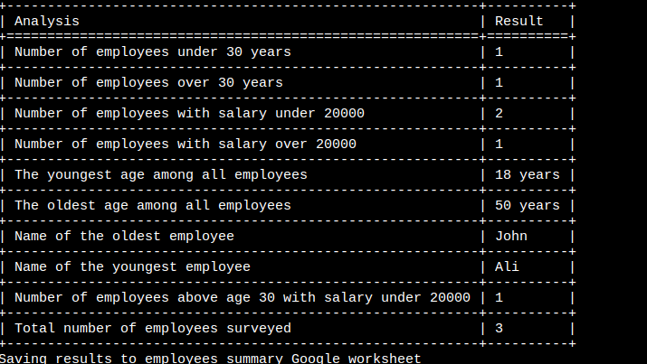
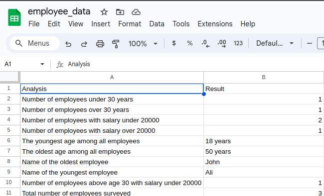
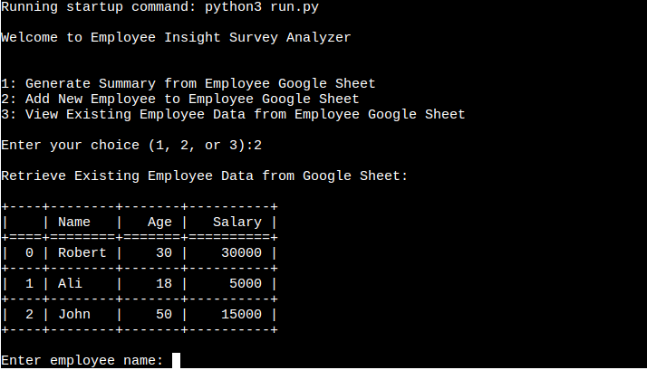
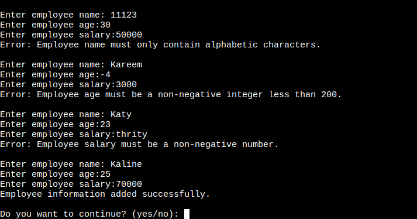
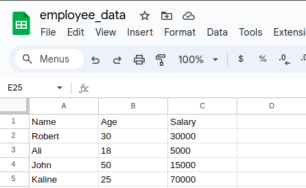
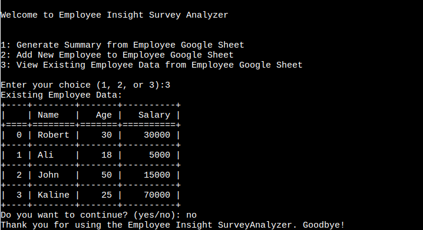
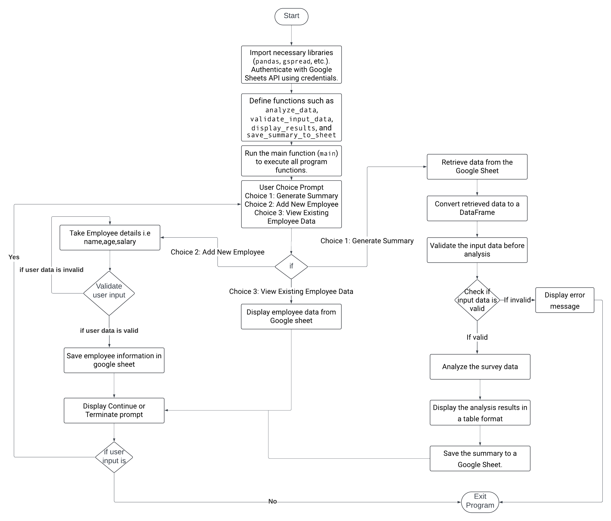

# Employee Insight Survey Analyzer

Welcome to the Employee Insight Survey Analyzer! This Python application is designed to empower employers with the tools they need to conduct insightful surveys based on their existing employee data. With Employee Insight Survey Analyzer, employers can seamlessly analyze their employee data stored in Google Sheets, gain valuable insights, and generate comprehensive summaries.

Employee Insight Survey Analyzer is a python terminal program, which runs in the CI mock terminal on Heroku.
 

Click here to use the program here: [Employee Insight Survey Analyzer](https://employee-insights-b63786ebfbf5.herokuapp.com/)

 

# Introduction
Comprehending your workforce as an employer is crucial to making well-informed decisions and cultivating a happy workplace. Employers may easily extract valuable insights from their current data pool by using the Employee Insight Survey Analyzer, which offers an intuitive interface for employee data analysis.

# Employee Insight Survey Analyzer

Welcome to the Employee Insight Survey Analyzer! This Python application is designed to help employers analyze survey data from their employees stored in a Google Sheet. The program offers various options to analyze data, add new employee information, and view existing employee data.

## How to Use

Upon running the program, you'll be presented with a main menu offering the following options:

1. **Generate Summary from Employee Google Sheet**: Retrieve survey data from the Google Sheet, analyze it, display summary in console and save the summary to a separate worksheet.
  
2. **Add New Employee to Employee Google Sheet**: Add new employee data to the Google Sheet.
  
3. **View Existing Employee Data from Employee Google Sheet**: View existing employee data stored in the Google Sheet.

4. **Exit**: Exit the program.

To use the program, follow these steps:

1. **Using Program Options**:
   - **Generate Summary from Employee Google Sheet**:
     - Select option 1 from the main menu.
      
     - The program will retrieve survey data from the Google Sheet named `employee_data`.
     - It will then perform analysis on the data, including counts of employees based on age and salary ranges, identifying the youngest and oldest employees, etc.
     - After analysis, the program will display the results in a tabular format.
    
     - Finally, it will save the summary data to a separate worksheet named `employee_summary` within the same Google Sheet for future reference.
    

   - **Add New Employee to Employee Google Sheet**:
     - Choose option 2 from the main menu.
     
     - Follow the prompts to enter the details of the new employee, including their name, age, and salary.
     - The program will validate the input to ensure correctness and completeness.
    
     - Once validated, the new employee data will be added to the Google Sheet named `employee_data`.
    

   - **View Existing Employee Data from Employee Google Sheet**:
     - Opt for option 3 from the main menu.
     - The program will retrieve existing employee data from the Google Sheet named `employee_data`.
     - It will display the data in a tabular format, showing the names, ages, and salaries of all employees currently stored in the sheet.
      

### Flowchart

## User Story

| Story Number | User Story                                                                                     | Description                                                                                                                                                                 |
|--------------|-----------------------------------------------------------------------------------------------|-----------------------------------------------------------------------------------------------------------------------------------------------------------------------------|
| 1            | As a user, I want to be able to analyze employee survey data stored in a Google Sheet         | So I can gain insights into employee demographics and trends.                                                                                                               |
| 2            | As a user, I want to add new employee data to the Google Sheet easily                          | So I can keep the employee database up-to-date.                                                                                                                              |
| 3            | As a user, I want to view existing employee data from the Google Sheet in a clear format       | So I can quickly understand the composition of our workforce.                                                                                                                |
| 4            | As a user, I want the program to validate input data for new employees                         | So I can ensure that accurate information is added to the employee database.                                                                                                 |
| 5            | As a user, I want the program to perform various analyses on the employee survey data          | Such as identifying the youngest and oldest employees, to help me understand the workforce distribution.                                                                     |
| 6            | As a user, I want the program to generate comprehensive summaries based on the survey data     | So I can present key findings to management and stakeholders.                                                                                                                |
| 7            | As a user, I want the program to be easy to use and navigate                                   | So that users with varying technical skills can utilize it effectively.                                                                                                       |
| 8            | As a user, I want the program to save analysis summaries to a separate worksheet within Google Sheet | So that historical data can be maintained for future reference.                                                                                                            |

## Features

The Employee Insight Survey Analyzer is designed to provide efficient analysis of survey data from employees stored in a Google Sheet. Here's a deeper look at its key features:

### 1. Data Analysis
   - **Comprehensive Analysis**: Utilizing the Pandas library, the application performs comprehensive analysis on employee data, including age and salary distributions. This allows employers to gain valuable insights into the demographics of their workforce and identify any salary trends.

### 2. Google Sheets Integration
   - **Seamless Data Retrieval**: Through the use of the `gspread` library and Google Sheets API, the application seamlessly retrieves survey data from the designated Google Sheet named `employee_data`. This integration ensures that the latest employee data is used for analysis.
   - **Adding New Employees**: Employers can easily add new employee data to the Google Sheet directly from the application. This ensures that the database remains up-to-date without the need for manual data entry.

### 3. User-Friendly Interface
   - **Intuitive Navigation**: The application provides a simple and intuitive menu-driven interface, allowing users to easily select and execute various options such as generating summaries, adding new employees, or viewing existing data.
   - **Error Handling**: Robust error handling mechanisms are implemented to validate input data. In case of any errors, informative error messages are displayed to guide users on how to rectify them, ensuring data accuracy and integrity.

### 4. Summary Saving
   - **Data Preservation**: Upon analysis, the application saves comprehensive summaries to a separate worksheet named `employee_summary` within the Google Sheet. This allows employers to maintain historical data and refer back to previous analysis results for future reference and comparison.
  
## Future Features

### 1. Export to CSV

- **Data Export**: Add functionality to export analysis results to CSV format.

### 2. Filtering Options

- **Segmented Analysis**: Provide filtering options for analysis results, allowing users to focus on specific area.

### 3. Feedback Mechanism

- **User Input Gathering**: Incorporate a feedback mechanism to gather user input and suggestions for further improvements to the application.

## Technologies and Libraries Used

The Employee Insight Survey Analyzer is built using the following technologies and libraries:

- **Python**: The core programming language used for development.
- **Google Sheets API**: Used to interact with Google Sheets for data retrieval and storage.
- **gspread**: Python library for accessing Google Sheets.
- **Pandas**: Data manipulation and analysis library used for processing survey data.
- **tabulate**: Python library for formatting tabular data for display.
- **google-auth**: Library for authenticating with Google services.
- **Credentials**: Used for handling Google OAuth2 credentials.

## Tools and Programs Used

During the development of this application, the following programs have been used:

- **Visual Studio Code**: Integrated Development Environment (IDE) used for writing and debugging code.
- **Lucid**: Tool used for creating diagrams and visual representations of system architecture.
- **Heroku**: Cloud platform used for deployment and hosting of the application.
- **Git**: Version control system used for tracking changes to the codebase.
- **GitHub**: Web-based hosting service for version control and collaboration.
- **Google Spreadsheet**: Online spreadsheet tool used for storing and managing survey data.
- **CI Python Linter**: Continuous integration tool used for Python linting and code quality checks.
